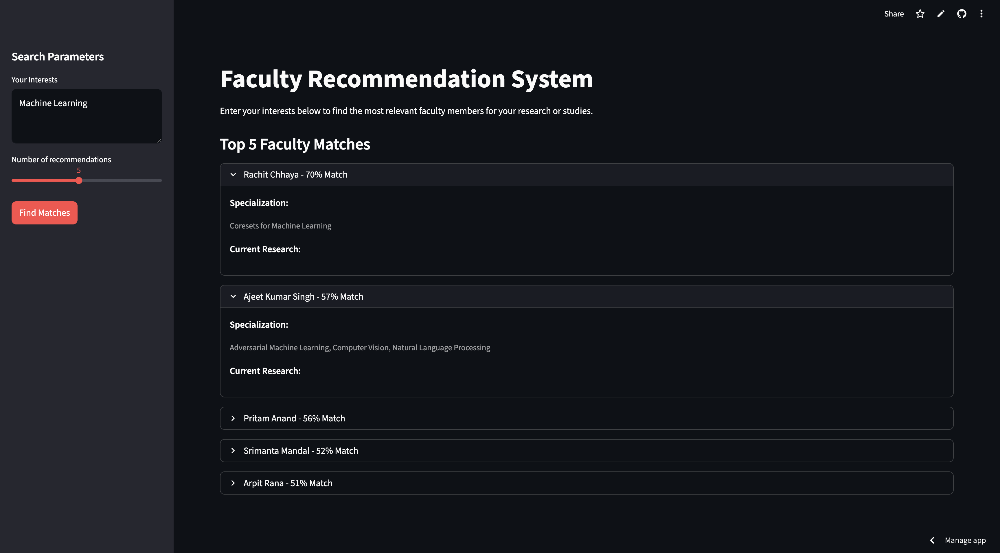

# Faculty Finder

Live Link: https://facutlyfinder-5tnqrfu5mpkdwkvppg2f3x.streamlit.app/


****
## Objective

Build a data pipeline to crawl, extract, and clean faculty data (names, bios, research interests) from a college website to provide a clean dataset for a semantic search engine.

## Team 

* Team Name: InfoScale
* Team Members:
  1. 202518023 Meet Gandhi
  2. 202518036 Kashyap Patel

## Data Sources

* https://www.daiict.ac.in/faculty

## Process Overview

The project follows a clear multi-stage pipeline. First, the `scrape/dau/` module is responsible for collecting faculty URLs and detailed faculty information from the DAU website and storing the raw scraped data as CSV files in the data/ folder. This raw data is then passed to the `preprocess/` module, which cleans, normalizes, and formats it so that it is consistent and ready for database insertion. Database handling is split into two layers: `dbConnection/` manages the SQLite connection, while `dbOperations/` creates the required tables and inserts the processed records into the `faculty_managment.db` file located in the `database/` directory. Finally, the API layer defined in `FastAPI.py` exposes endpoints to query and serve the stored faculty data, and the root `main.py` coordinates the overall workflow from data preparation to database population and API readiness.

## Folder Structure

```
FACULTYFINDER/
│
├── data/
│   ├── dau-faculty.csv
│   └── faculty.csv
│
├── database/
│   └── faculty_managment.db
│
├── dbConnection/
│   └── db_connection.py
│
├── dbOperations/
│   ├── get_data.py
│   ├── tables_create.py
│   └── tables_insert.py
│
├── preprocess/
│   └── preprocess.py
│
├── scrape/
│   └── dau/
│       ├── __init__.py
│       ├── faculty_details.py
│       ├── faculty_url.py
│       └── main.py
│
├── .gitignore
├── FastAPI.py
├── main.py
└── README.md
```

* `scrape/dau/` – Web scraping logic (URLs, faculty details, entry point)
* `preprocess/` – Data cleaning and transformation
* `data/` – Scraped CSV datasets
* `database/` – SQLite database file
* `dbConnection/` – Database connection utilities
* `dbOperations/` – Table creation, insertion, and data access
* `FastAPI.py` – FastAPI application
* `main.py` – Main execution script

## Statistics

* Names: 112 (all unique)
* Emails: 111 non-null, all unique
* Phone numbers: 80 non-null, 78 unique
* Faculty websites: 47 available
* Bios: 70 available
* Teaching info: 59 available
* Education field: 110 available
* Specialization: 109 available (some empty lists)
* Research info: mostly empty
* Room numbers: 75 available

**Education distribution**
* Most common degree: PhD (Computer Science) 16 faculty
* Total distinct education entries: 60

**Institutes**
* Most common education institute: DA-IICT Gandhinagar 7 faculty
* Teaching institute: DAU 75 faculty

**Countries (education)**
* Total countries: 16
* Top country: USA (13 faculty)

## How to Run

### Requirements

Install the required dependencies:
```
pandas>=2.0
beautifulsoup4>=4.12
fastapi>=0.110
uvicorn[standard]>=0.27
streamlit==1.53.1
sentence-transformers==5.2.2
torch
```

### Steps to run

#### Step 1: Scrape data

From the root directory, run:
```
python scrape.dau.main
```

#### Step 2: Create and populate the database

From the root directory, run:
```
python main.py
```

#### Step 3: Start the server

Run:
```
uvicorn FastAPI:app
```

#### Step 4: Start Client

Run:
```
streamlit run ./client/app.py
```

**IMPORTANT NOTE**: One can use `backend.sh` and `frontend.sh` scripts to run the application.
